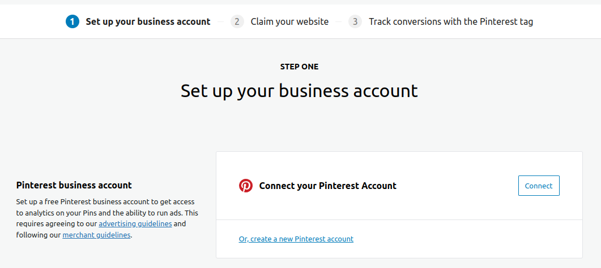
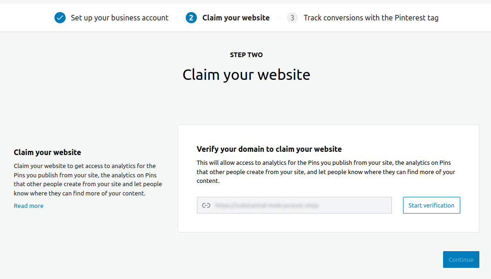
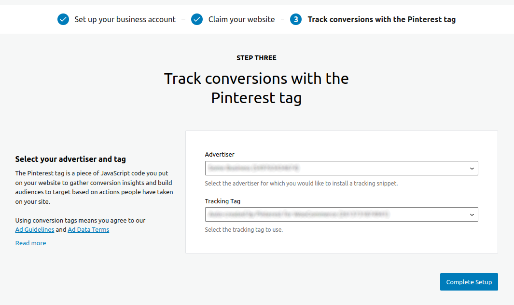
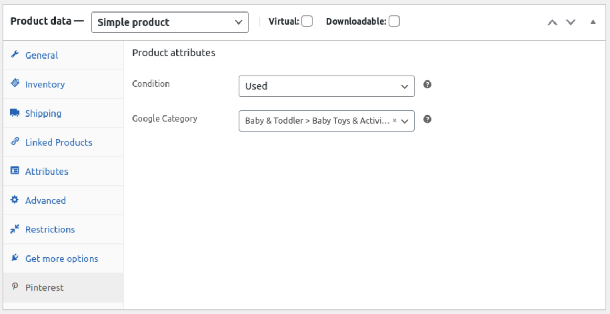

# Pinterest for WooCommerce - Testing & Flows

This file is a collection of the flows (key UI and features) that are implemented.

These flows can be used when testing PRs or releases, and as a basis for documentation.

## Onboarding & connection

- Merchant can connect and disconnect to a valid Pinterest Business account.
- Helpful error messages are shown if the connection fails (e.g. Pinterest account is invalid or unverified).
- Unauthorised users cannot connect, disconnect or verify domain.

### Step 1. Connect the plugin to the Pinterest Business account

- Personal Pinterest account: should guide you to Create a Business Account or Convert your personal Account to Business account.
- Personal Account linked with Business account: should connect to the Business account linked on the Personal account.

  

### Step 2. Verify the store's domain

  

### Step 3. Select the Advertiser and the Tracking Tag

- If a Merchant does not have an Advertiser, the plugin will allow to create a new one automatically after accepting the 'Terms and Conditions'.
- If a merchant has 1 or more Advertisers, the plugin allows you to select one and an associated Tracking Tag.
- If the selected Advertiser does not have an associated Tracking Tag, the plugin will create a new one automatically for the selected Advertiser.

  

## Domain Verification

- The store's webiste is verified during the onboarding process.
- Stores located on subdomains and subdirectories (for example, `example.com/shop`) are supported since `v1.0.9`.
- Stores whose URL contains uppercase letters (for example, `example.com/SHop`) are supported.
- A URL can be claimed and verified only by a Merchant. A helpful error is displayed if a Merchant attempts to claim an already claimed website.

## Catalog (product) sync

- The feed is generated by asynchronous tasks controlled by the Action Scheduler framework since `v1.0.10`.
- The feed generator obtains a batch of products during each generation cycle.
- The feed is registered in the Merchant account once the feed is successfully generated.
- Pinterest ingests the feed every 24 hours once it is properly registered and approved in the Merchant account.
- Product Sync can be enabled/disabled on the Settings page (Product Sync > Enable Product Sync option).
- The feed is rebuild every 24 hours.
- The feed generation process starts again if the feed is set as dirty during the feed generation. The feed is set as dirty whenever:
  - A product is added or edited.
  - The stock of a single or variation product is modified.
  - The option `update_option_woocommerce_hide_out_of_stock_items` is updated.
  - The option `update_option_woocommerce_tax_display_shop` is updated.
  - The option `update_option_woocommerce_tax_display_cart` is updated.
- The feed will be deleted from site (not from Pinterest account) when:
  - Disable 'Enable Product Sync' option on Settings page.
  - Deactivate plugin.
- Feeds will be deleted from Pinterest account when the user disconnects from the account on the Connection tab.
- Products that meet any of the following statements will be excluded from the feed:
  - Products with visibility set to `Hidden` or `Search results only` (since `v1.0.9`).
  - Private, draft or trashed products.
  - Products with price = 0.
  - Products out of stock if the option `woocommerce_hide_out_of_stock_items` is enabled (since `v1.0.9`).
- The plugin product feed includes the following product types by default (since `v1.2.9`):
  - Simple products.
  - Variation products (the parent Variable product is not included since `v1.0.9`).
- The plugin product feed excludes the following product types by default (since `v1.2.9`):
  - Grouped products
  - Subscription products
- The product types included/excluded in the feed can be modified by the `pinterest_for_woocommerce_included_product_types` and `pinterest_for_woocommerce_excluded_product_types` filters. The filter to exclude product types takes precedence over the include filter (since `1.2.9`).

## Connection page

- Linked Account: shows the `user_id` that is connected to Pinterest.
- Clicking on `Disconnect` button:
  - The plugin will be disconnected from Pinterest.
  - It will delete all feeds on the Pinterest account.
- Verified domain: should show that domain is verified and allows to re-verify if the user unclaims the site directly on the Pinterest account.
- Track conversions: shows the selected Advtertiser and Tracking Tag and allows to modify the selection if the Merchant has multiple Advertisers and Tracking Tags.

## Save to Pinterest button

- Shopper can save (pin) products to Pinterest from product page and archive pages, e.g. shop page.

## Rich pins

- Merchant can expose [OpenGraph metadata](https://ogp.me/) for products and posts to enable Rich Pins.
- Metadata passes validation in [Pinterest Rich Pins Validator](https://developers.pinterest.com/tools/url-debugger/).
  - Example for product:

  ```<meta property="og:url" content="https://{URLsite}/product/beanie/">
  <meta property="og:site_name" content="Mass Grasshopper">
  <meta property="og:title" content="Beanie">
  <meta property="og:type" content="og:product">
  <meta property="og:image" content="https://{URLsite}/wp-content/uploads/2021/11/beanie.jpg">
  <meta property="product:price:currency" content="USD">
  <meta property="product:price:amount" content="18">
  <meta property="og:price:standard_amount" content="20">
  <meta property="og:description" content="Pellentesque habitant morbi tristique senectus et netus et malesuada fames ac turpis egestas. Vestibulum tortor quam, feugiat vitae, ultricies eget, tempor sit amet, ante. Donec eu libero sit amet quam egestas semper. Aenean ultricies mi vitae est. Mauris placerat eleifend leo.">
  <meta property="og:availability" content="instock">
  ```

  - Example for posts:
  
  ```<meta property="og:url" content="https://{URLsite}/2021/11/08/hello-world/">
  <meta property="og:site_name" content="Mass Grasshopper">
  <meta property="og:type" content="article">
  <meta property="og:title" content="Hello world!">
  <meta property="og:description" content="Welcome to WordPress. This is your first post. Edit or delete it, then start writing!">
  <meta property="article:published_time" content="2021-11-08T11:12:15+00:00">
  <meta property="article:author" content="demo">
  ```
  
## Conversion tracking

- Merchant will be able to track conversion events.
- Merchant can enable/disable conversion tracking in the plugin's settings tab (Enabled by default).
- Merchant can enable/disable `Enchanced Match Support`, which will add customer emails to conversion tracking.
- If enabled, Conversion will [track activities](https://help.pinterest.com/en/business/article/track-conversions-with-pinterest-tag):
  - Page Visit: fires every time a user visits a page

    ```<script>pintrk( 'track', 'pagevisit', );</script>```

  - View category: fires every time a user visits a category page

    ```<script>pintrk( 'track', 'ViewCategory' , {"product_category":16,"category_name":"Accessories"},); </script>```

  - Search: fires every time a user searches something on the page

    ```<script>pintrk('track', 'search', {search_query: 'hoodie'},);</script>```

  - Add to Cart: fires every time a user adds product to cart from Shop/Category/Product pages

    ```<script>pintrk('track', 'AddToCart', {product_id: 10,order_quantity: 1,});</script>```

  - Checkout: fires every time a user places an order

    ```<script>pintrk( 'track', 'checkout' , {"order_id":45,"value":"220.00","order_quantity":4,"currency":"USD","line_items":[{"product_id":3,"product_name":"Belt","product_price":"55","product_quantity":3,"product_category":["Accessories"]},{"product_id":4,"product_name":"Hoodie with Logo","product_price":"45","product_quantity":1,"product_category":["Hoodies"]}]});</script>```

## Google Category and Condition fields

The Pinterest plugin will add these fields in an attributes tab on the product edit page. Pinterest does not require these fields, but if they are not filled in, a warning message will be displayed in the Catalog tab (alert message).



## Miscellaneous

- Pinterest admin screens are visible and accessible in all supported WooCommerce Admin navigation variations (current WP sidebar and [forthcoming unified nav](https://developer.woo.com/2021/01/15/call-to-action-create-access-for-your-extension-in-the-new-woocommerce-navigation/)).
